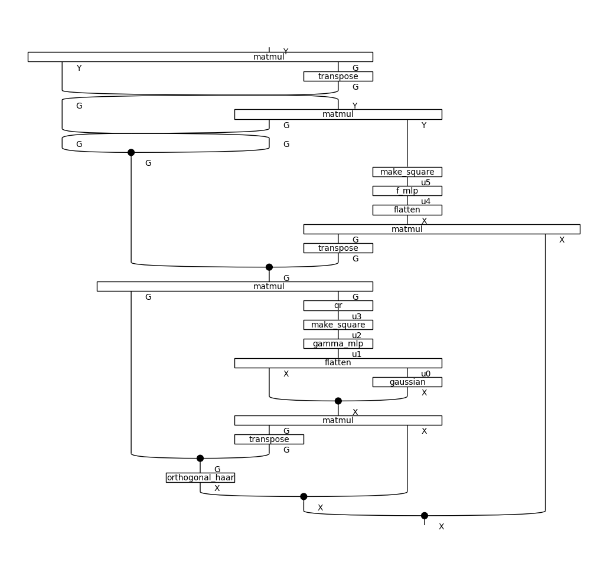

# README

This repo contains the code for the paper [Stochastic Neural Network Symmetrisation in Markov Categories](https://arxiv.org/abs/2406.11814).

## Getting started

### Requirements

The requirements of this repo are:

* Python 3.12
* A [wandb](https://wandb.ai) account (that you have logged in to on your system)

By default, output is written to a wandb project called `stoch-sym`, although this can be changed using the `--wandb-project` command line argument.

### Setup

The following walks through a basic setup using venv.
Inside the base directory of this repo, do the following:

    $ git submodule init
    $ git submodule update
    $ python -m venv .venv
    $ . .venv/bin/activate
    $ pip install -r requirements.txt

(The first two steps are needed because we make use of the [emlp-pytorch](https://github.com/jw9730/emlp-pytorch/) package as a submodule, which is a PyTorch port of the official [equivariant-MLP](https://github.com/mfinzi/equivariant-MLP) implementation in JAX.)

At this point, you should be able to run the script `main.py` in the main directory of this repository.

## Basic usage

The following command will train our method (i.e. with `gamma` obtained via symmetrisation) on a 4-dimensional covariance estimation problem. 

    ./main.py --dataset cov --config dim=4 --group orth --input-action lmul --output-action conj --backbone mlp --gamma mlp-haar

Notice that the group and actions are set here as per Section 7.3 of the [paper](https://arxiv.org/pdf/2406.11814).
Other datasets and models can be run by specifying different values for these arguments.

### Reproducing paper

Running `./print_runs.sh` prints all the different arguments to `main.py` necessary to train the various models from Section 7.3 of the paper.
To actually *run* these, you can use `xargs`, for example as follows:

    ./print_runs.sh | xargs -L1 ./main.py

After running these, the script `plot_results.py` can be used to reproduce the plots from the paper.
To use this, first do a CSV export of the runs you have launched (via `Runs->CSV Export` on the wandb console).
Then run the following:

    ./plot_results.py /path/to/wandb/export.csv

## How it works

An interesting aspect of the implementation here is that it uses [DisCoPy](https://discopy.org/) behind the scenes to describe the overall *string diagram* of the models in a symbolic way, before actually converting these to actual PyTorch models.
This provides a very expressive way to specify models at a high level of abstraction that is easily reconfigurable and visualisable (much more so than working with PyTorch modules directly for all components all the time).

### Overview

The basic workflow we use to do this is the following:

    "Coarse" string diagram --> "Fine" string diagram --> Actual PyTorch model

In other words:

   1. Generate a basic "coarse" string diagram for the configuration specified
   2. Map the coarse string diagram to a "fine" string diagram
   3. Map the fine string diagram to a concrete PyTorch model

Here both the coarse and fine string diagrams are represented in code as DisCoPy diagrams, while the PyTorch model is an `nn.Module`.
In categorical terms, the second and third steps are formalised as applying a *functor* to the coarse and fine string diagrams respectively.

We detail these steps now.

### "Coarse" string diagram

Run the following command:

    ./main.py --dataset cov --config dim=4 --group orth --input-action lmul --output-action conj --backbone mlp --gamma mlp-haar --draw-coarse-string-diagram

You should see a diagram like the following appear:

This contains a "coarse" string diagram of the overall model used in the command mentioned above, at essentially the same level of abstraction as the diagram in Section 5.4 of the [paper](https://arxiv.org/pdf/2406.11814).
Internally, the diagram is represented in code as a `discopy.markov.Diagram` (see the [DisCoPy docs](https://docs.discopy.org/en/main/_api/discopy.markov.html)).

The generation of this string diagram occurs in `get_coarse_string_diagram()` in `stoch_sym/model/coarse_string_diagram.py`.

### "Fine" string diagram

Note that the coarse string diagram above doesn't specify certain subcomponents very concretely.
For example, `inv` (which represents group inversion) is kept generic here, whereas when the group in question is the orthogonal group, we want this actually to compute the transpose function. 

Our next step is therefore to map the coarse string diagram to a finer one. To see the result of this, do:

    ./main.py --dataset cov --config dim=4 --group orth --input-action lmul --output-action conj --backbone mlp --gamma mlp-haar --draw-fine-string-diagram

You should see a diagram like the following:

The idea is that at this step, there is a more explicit mapping from the string diagram to actual PyTorch code.
Notice that the overall structure is similar to what we had before, but e.g. `inv` has been replaced by a box labelled `transpose`, and e.g.  `f` has been replaced by a sequence of three boxes `flatten --> f_mlp --> make_square`.

The functor that performs this step is implemented in `get_fine_string_diagram_functor()` in `stoch_sym/model/fine_string_diagram.py`.

### PyTorch model

When we actually want to run the model, as the third and final step, we map from the fine string diagram to actual PyTorch code.
The idea here is that we implement here a functor that maps from the Markov category of string diagrams to the Markov category of Python types and Python functions.
For example, the `transpose` box above is mapped to an actual PyTorch function that does matrix transposition, etc.
The resulting morphism is then our overall model and can be trained using SGD.

This step is implemented by `get_module()` in `stoch_sym/model/pytorch_model.py`.

